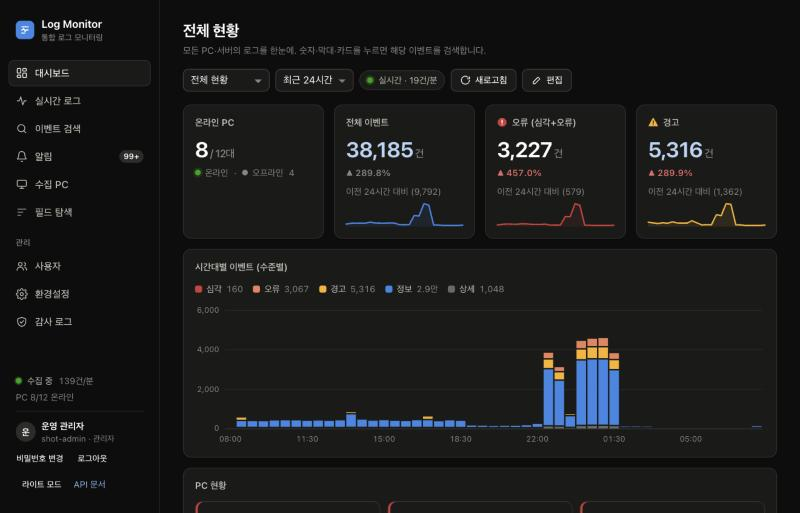
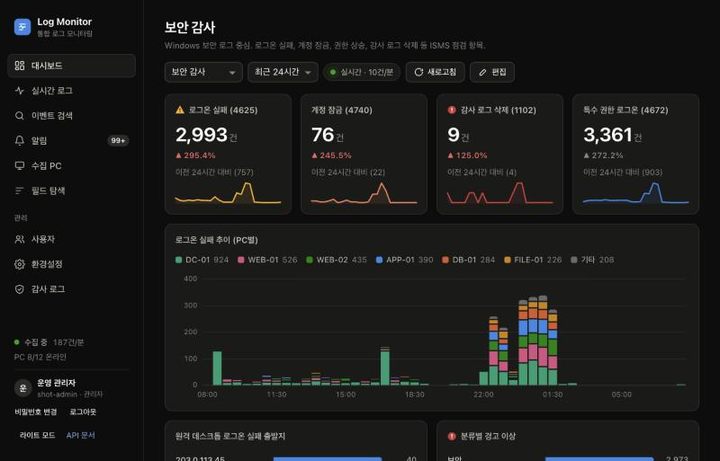
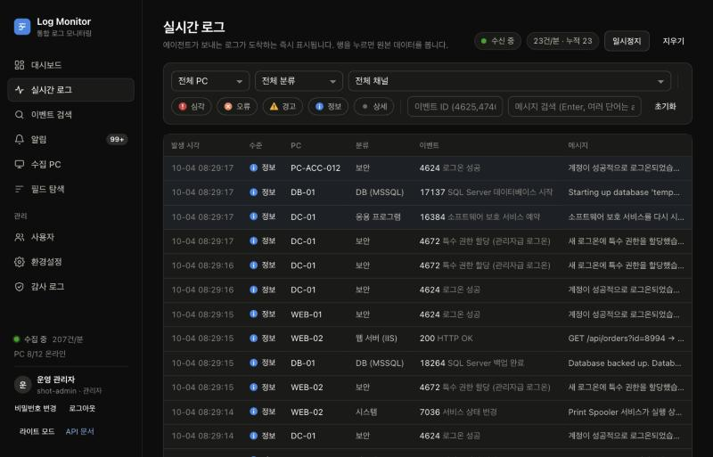
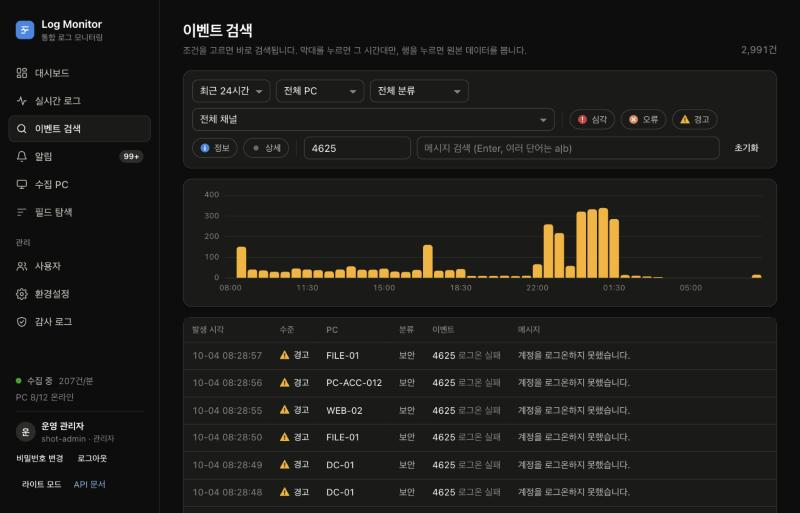
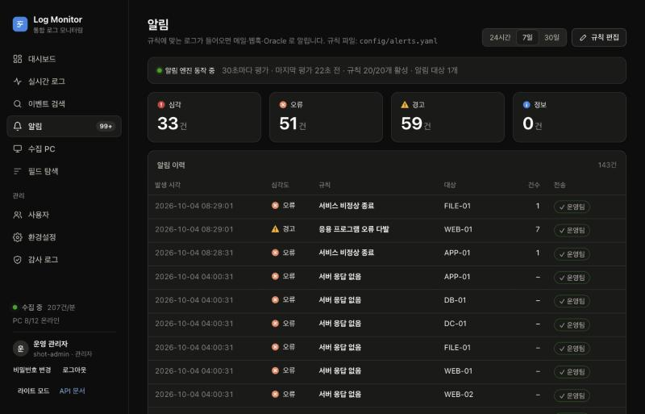

<p align="center">
  
</p>

<h1 align="center">Log Monitor</h1>

<p align="center">
  Windows 서버·PC 로그를 한곳에 모아 실시간으로 보는 <b>오픈소스 로그 모니터링</b><br>
  Docker 로 바로 띄우고, 폐쇄망에도 설치할 수 있습니다.
</p>

<p align="center">
  <a href="LICENSE"></a>
  
  
  
  
</p>



## 주요 기능

- **수집:** Windows 이벤트 로그(보안·시스템·응용·PowerShell·Defender·원격 데스크톱·Sysmon), IIS 접속 로그, SQL Server ERRORLOG, Linux journald, syslog(네트워크 장비), 텍스트 파일
  - 에이전트는 [Fluent Bit](https://fluentbit.io) 입니다. 서버가 끊겨도 디스크에 쌓아 두었다가 보냅니다.
- **분류·공통 필드:** 13개 분류(보안, 웹 서버, DB …)와 공통 필드(사용자·접속 IP)로 정리합니다.
  - "이 IP 가 어디를 두드렸나" 를 Windows·IIS·SQL Server·SSH 로그에서 한 번에 찾습니다.
- **대시보드:** 전체 현황·보안 감사·웹 서버·DB 기본 제공. 새 로그가 오면 숫자·막대·표가 **실시간**으로 바뀝니다.
  - 위젯 구성은 JSON 파일이고, 화면의 편집 버튼으로 바로 고칩니다.
- **검색:** 기간·PC·분류·수준·이벤트 ID·사용자·IP·원본 필드(`f.EventData.LogonType=10`)·메시지(`timeout|refused`). 원본 JSON 은 그대로 보존합니다.
- **알림:** 기본 규칙 20개를 제공합니다.
  - 대상: 무차별 대입(출발지 IP 별), RDP 공격, 계정 잠금, 관리자 그룹 추가, 감사 로그 삭제, 의심 PowerShell, 악성 코드 탐지, IIS 5xx, SQL Server 로그인 실패·심각 오류, 서버 응답 없음 …
  - 규칙마다 MITRE ATT&CK·ISMS 항목 태그가 붙습니다.
  - **메일·웹훅·사내 Oracle DB** 로 보냅니다. 수신자·그룹·받을 최소 수준은 화면에서 관리합니다.
- **보안·감사 (ISMS-P 대비):** 개인 계정·역할(관리자/조회자), 비밀번호 정책·잠금·세션 만료, 수정·삭제할 수 없는 감사 로그, 비밀값 암호화 저장.
- **로그 로테이션:** DB(90일, 빠른 검색) → 압축 보관 파일(SHA-256 무결성) → 365일 후 삭제. 필요하면 복원합니다.
- **폐쇄망 배포:** 인터넷 PC에서 반입 묶음을 만들고, 서버에서 스크립트 하나로 설치·업그레이드합니다.
- **100% 오픈소스, 단순한 구성:** 컨테이너 3개(PostgreSQL, API, syslog 수신기). UI 는 빌드 도구 없는 순수 JS 입니다.

## 화면

| 보안 감사 대시보드 | 실시간 로그 |
|---|---|
|  |  |
| **이벤트 검색** | **알림** |
|  |  |

## 구성

```
[Windows PC·서버]  Fluent Bit ─┐  이벤트 로그 + (선택) IIS 접속 로그, SQL Server ERRORLOG
[Linux 서버]       Fluent Bit ─┼─ HTTP(gzip JSON, API 키) ─▶ [api: FastAPI] ─▶ [PostgreSQL 17]
[네트워크 장비] syslog ─▶ [collector: Fluent Bit] ─┘                │   월별 파티션, 원본 JSONB
                                           웹 UI · 실시간(SSE) · 알림 엔진 → 메일 / 웹훅 / Oracle
```

## 빠른 시작 (개발·체험)

필요한 것: Docker Desktop(또는 Docker Engine + Compose), Python 3(시뮬레이터용).

```bash
git clone https://github.com/gatsjy/windows_log_monitor.git
cd windows_log_monitor
docker compose up -d --build      # db + api + 개발용 메일함 (코드 수정 시 자동 반영)
python3 tools/simulate.py         # 가짜 PC·웹 서버·DB 서버가 로그를 보냄 (과거 24시간치 + 실시간)
```

- 브라우저에서 **http://localhost:8080** 을 엽니다.
- 개발 환경은 `.env` 없이 기본값으로 동작합니다. 운영에서는 반드시 `.env` 를 만듭니다(아래 운영 배포).
- **첫 로그인:** `admin` 계정의 임시 비밀번호가 서버 로그에 한 번 출력됩니다. 첫 로그인 때 바꿉니다.

```bash
docker compose logs api | grep "초기 관리자"
docker compose exec api python -m app.cli reset-password admin   # 놓쳤거나 잊었을 때
```

- API 문서: http://localhost:8080/docs
- 개발용 메일함(알림 메일 확인, Mailpit): http://localhost:8025

## 에이전트 설치

| 대상 | 방법 |
|---|---|
| Windows | [agent/windows](agent/windows/README.md) — Fluent Bit 설치 후 `install.ps1` (웹 서버는 `-Iis`, DB 서버는 `-MssqlErrorlog`) |
| Linux | [agent/linux](agent/linux/README.md) — Fluent Bit 설치 후 `install.sh`, 또는 rsyslog 전달 |
| 네트워크 장비 | syslog 대상을 `서버IP:514` 로 지정 (`--profile syslog` 필요) |

```powershell
# Windows (관리자 PowerShell)
powershell -ExecutionPolicy Bypass -File .\install.ps1 -ServerHost 10.0.0.10 -ApiKey <수집 API 키>
```

## 운영 배포

```bash
cp .env.example .env    # 비밀번호·수집 API 키·WLM_SECRET_KEY 를 반드시 변경 (openssl rand -hex 32)
docker compose -f docker-compose.yml up -d --build                     # 개발용 override 제외
docker compose -f docker-compose.yml --profile syslog up -d --build    # syslog 수신기 포함
```

- `WLM_PUBLIC_URL`(알림 메일 링크 주소)을 사용자가 접속하는 주소로 바꿉니다.
- 메일 서버·수신자·Oracle 은 **환경설정** 화면에서 설정하고 테스트 버튼으로 확인합니다. Oracle 테이블은 [docs/oracle_alerts.sql](docs/oracle_alerts.sql) 로 만듭니다.
- HTTPS 리버스 프록시 뒤에서 운영하면 `WLM_COOKIE_SECURE=true` 로 둡니다.
- `.env`(암호화 키 포함), `archive/`(보관 파일), DB 백업은 따로 보관합니다. 백업·점검 항목은 [docs/PROJECT.md](docs/PROJECT.md) §13 과 [docs/ISMS.md](docs/ISMS.md) 를 봅니다.

### 폐쇄망 (인터넷 없는 사내망)

```bash
./deploy/airgap/make-bundle.sh            # 인터넷 PC: x86 서버용 반입 묶음 (Apple Silicon 에서도 amd64 로 빌드)
# → 해시 확인·반입 승인 → 서버에서:
sudo ./deploy/airgap/install.sh --public-url http://logmon.corp.local:8080 --syslog
```

- 서버에서는 무결성을 확인하고, 비밀값을 무작위로 만든 뒤, 인터넷 없이 기동합니다.
- 업그레이드는 `--upgrade` 입니다. DB 를 자동 백업하고, 화면에서 고친 설정은 보존합니다.
- 전체 절차(Docker 오프라인 설치, 반입 기록 양식, 되돌리기)는 [docs/AIRGAP.md](docs/AIRGAP.md) 에 있습니다.

## 자주 쓰는 명령

```bash
docker compose logs -f api                                   # 서버 로그
docker compose exec api python -m pytest                     # 테스트 (단위 + 통합)
docker compose exec api ruff check --no-cache app tests      # 린트
docker compose exec api python -m app.cli retention-status   # 로그 보관 현황
docker compose exec api python tools/bench/bench.py --rows 5000000   # 성능 측정 (별도 DB)
docker compose down                                          # 중지 (데이터 유지)
```

## 문서

| 문서 | 내용 |
|---|---|
| [docs/PROJECT.md](docs/PROJECT.md) | 전체 명세: 데이터 흐름, 정규화·분류, API, 대시보드, 알림, 인증, 로테이션, 운영 |
| [docs/AIRGAP.md](docs/AIRGAP.md) | 폐쇄망 배포·업그레이드·되돌리기 |
| [docs/ISMS.md](docs/ISMS.md) | ISMS-P 통제 항목 대응, 심사 증적, 알림 규칙과 항목 매핑 |
| [docs/PERFORMANCE.md](docs/PERFORMANCE.md) | 500만 건 검색 성능 측정, 용량 가이드 |
| [docs/COMPARISON.md](docs/COMPARISON.md) | Wazuh·Graylog·ELK·Loki 와 비교 |
| [docs/DECISIONS.md](docs/DECISIONS.md) | 설계 결정 기록 (ADR) |
| [docs/BACKLOG.md](docs/BACKLOG.md) | 앞으로 만들 것 (우선순위·완료 기준) |
| [CHANGELOG.md](CHANGELOG.md) | 버전별 변경 내역 |
| [AGENTS.md](AGENTS.md) | 개발 규칙 (사람·AI 에이전트 공통) |

## 구성요소와 라이선스

이 프로젝트는 [MIT 라이선스](LICENSE) 입니다. 함께 쓰는 구성요소도 모두 OSI 승인 오픈소스입니다.

| 구성요소 | 역할 | 라이선스 |
|---|---|---|
| Fluent Bit | 수집 에이전트 / syslog 수신기 | Apache 2.0 |
| PostgreSQL 17 | 저장소 | PostgreSQL License |
| FastAPI, Uvicorn | API 서버 | MIT, BSD-3 |
| psycopg 3 | PostgreSQL 드라이버 | LGPL-3 |
| PyYAML | 알림 규칙 파일 | MIT |
| cryptography | 환경설정 비밀값 암호화 | Apache 2.0 / BSD |
| python-oracledb | Oracle 알림 연동 (thin 모드, Oracle Client 불필요) | Apache 2.0 / UPL 1.0 |
| Mailpit | 개발용 메일 수신함 (운영 미사용) | MIT |
| 웹 UI | 순수 HTML/CSS/JS (외부 라이브러리 없음) | MIT (이 프로젝트) |

- 연동 대상인 Oracle Database 자체는 사내 기존 자산이며 이 저장소에 포함되지 않습니다.

## 기여·보안

- 기여 방법: [CONTRIBUTING.md](CONTRIBUTING.md)
- 보안 취약점 신고와 운영 보안 점검: [SECURITY.md](SECURITY.md)
